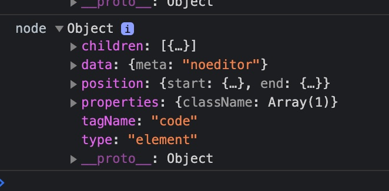
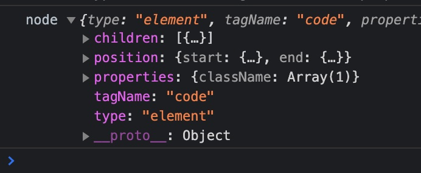

# ReactMarkdown Testing

## Start

1. Clone repo
2. `npm i`
3. `npm run dev`
4. Open JavaScript console and inspect the nodes which correspond to the three code fences in `src/App.tsx`:



5. Open `src/App.tsx` and uncomment out line 104 to enable the `reype-raw` plugin

```typescript
    remarkPlugins={[gfm]}
-    // rehypePlugins={[rehypeRaw]}
+    rehypePlugins={[rehypeRaw]}
    children={markdown}
```

6. Re-inspect the nodes to see the missing information:


